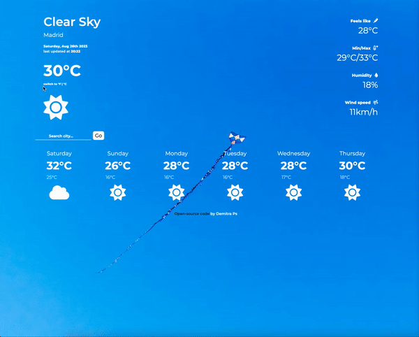
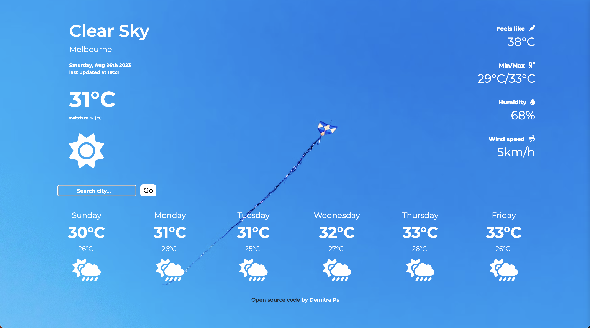
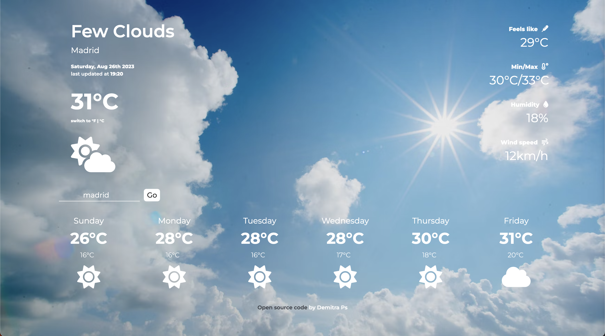
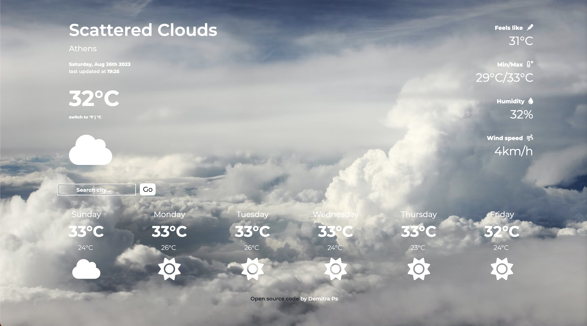
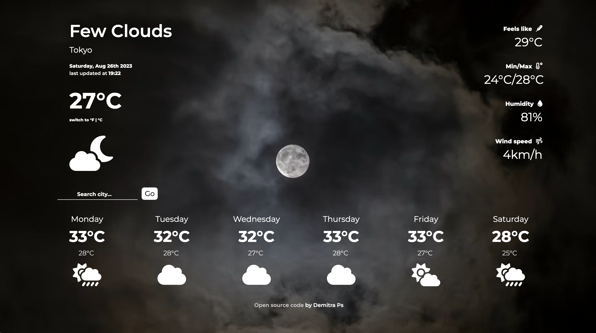
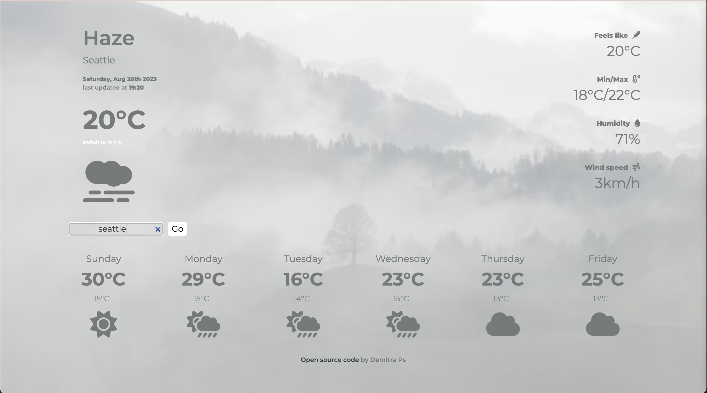

# React Weather App 

This is a weather app using [OpenWeather's API](https://openweathermap.org/).
Deployed in Netlify: https://weather-app-react-demitraps.netlify.app/

## Features

- Date/time
- Weather description
- Temperature
- Feel like / Min/Max temperature
- Humidity and wind
- Icons and background change based on current weather
- Temperature switch from Fahrenheit to Celsius and vice versa
- Search by city
- 6-day forecast
- Responsive design

## Demo




## Screenshots
Examples:













### Cloning the repository

```bash
  git clone https://github.com/demitraps/weather-app-react.git
```

## Available Scripts

In the project directory, you can run:

### `npm start`

Runs the app in the development mode.\
Open [http://localhost:3000](http://localhost:3000) to view it in your browser.

The page will reload when you make changes.\
You may also see any lint errors in the console.

### `npm test`

Launches the test runner in the interactive watch mode.\
See the section about [running tests](https://facebook.github.io/create-react-app/docs/running-tests) for more information.

### `npm run build`

Builds the app for production to the `build` folder.\
It correctly bundles React in production mode and optimizes the build for the best performance.

The build is minified and the filenames include the hashes.\
Your app is ready to be deployed!

